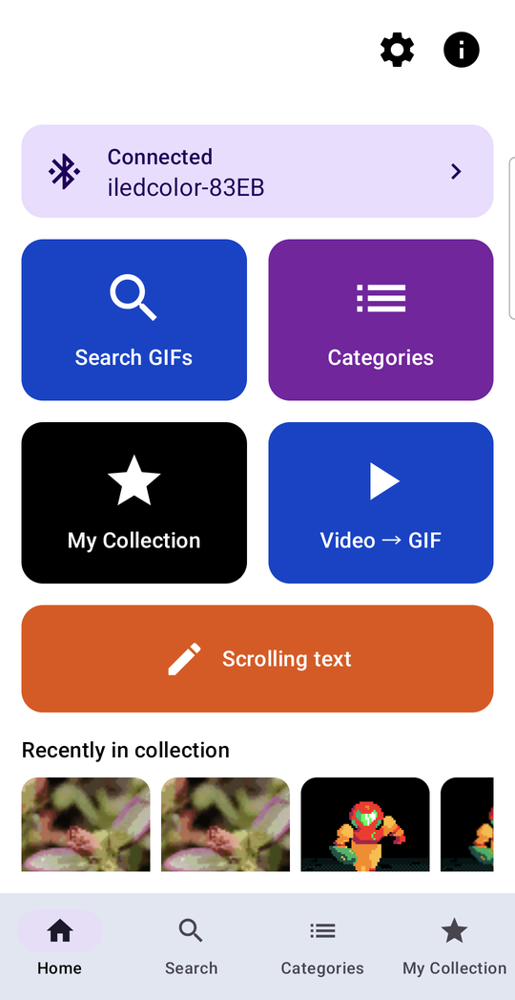
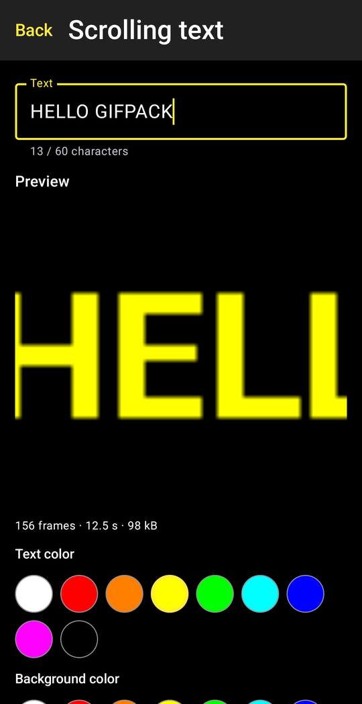
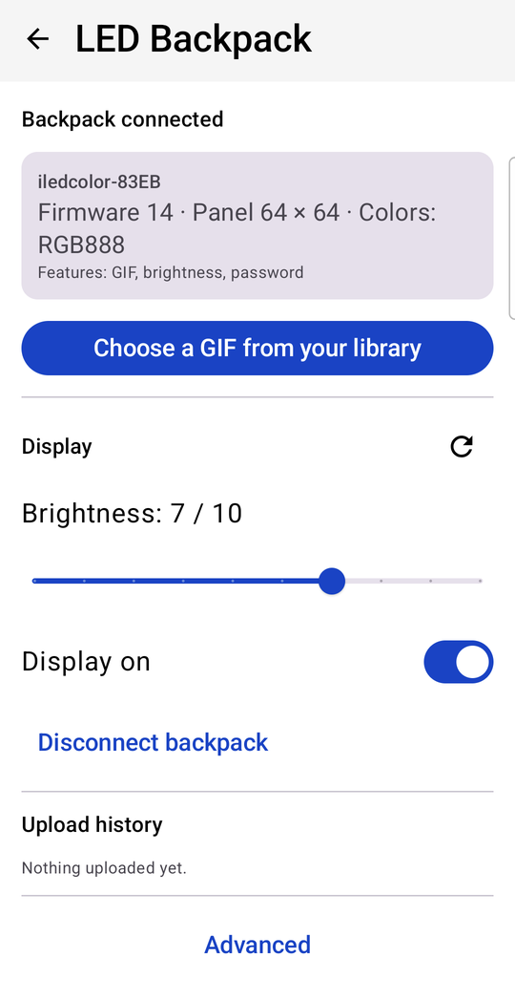
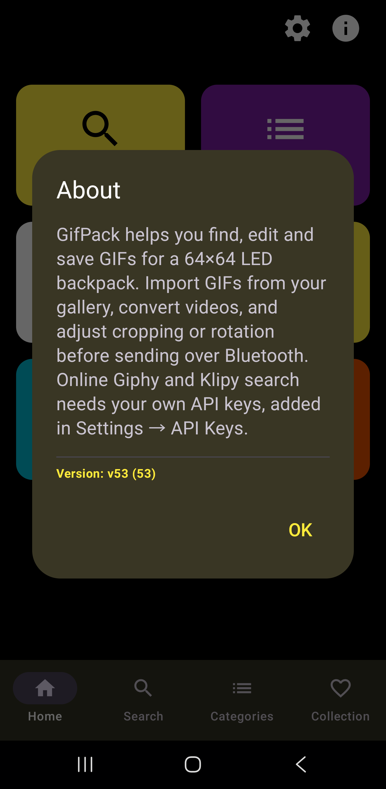
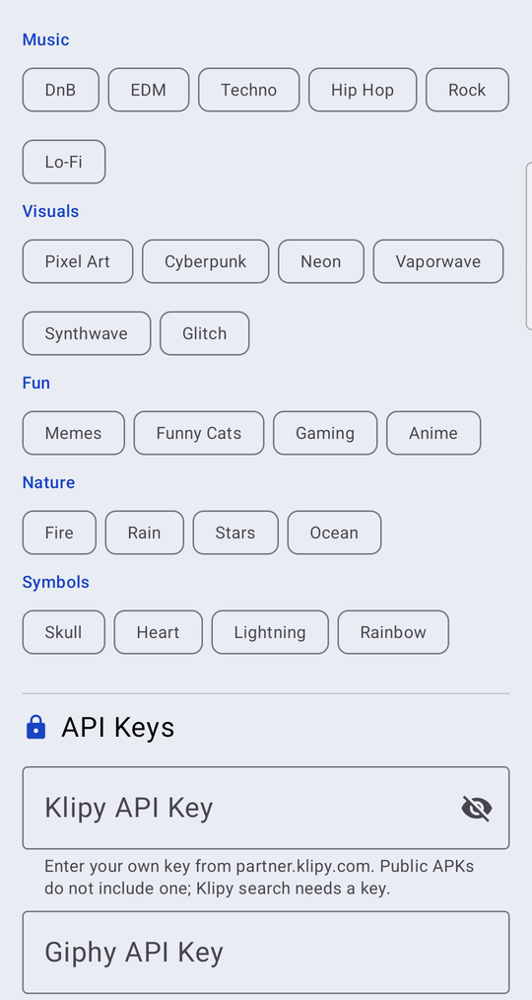

# GifPack

*Repository: `iledcolor-backpack` — an unofficial open-source Android client and BLE protocol
documentation for iledcolor-compatible 64 × 64 LED backpacks.*

[](https://github.com/PeterkoCZ91/iledcolor-backpack/actions/workflows/ci.yml)
[](https://developer.android.com/about/versions/oreo)
[](https://kotlinlang.org/)
[](https://developer.android.com/jetpack/compose)
[](LICENSE)

An Android app that finds, collects, converts and edits animated GIFs and sends them over
Bluetooth Low Energy to an **iledcolor-compatible 64 × 64 LED backpack**. It replaces the
manufacturer app for one job — getting the animation you want onto the panel — with a local
library, a 64 × 64 editor, a scrolling-text generator and an upload that reports what the
backpack actually confirmed.

> **Project status:** debug builds only (versionCode 62); there is no store listing or
> signed release. **Download:** the APK is on the
> [releases page](https://github.com/PeterkoCZ91/iledcolor-backpack/releases) (pre-release, no
> login, no API keys inside). GIF upload, several programmes played in turn, joining GIFs, the
> scrolling text banner, display brightness, screen on/off, the device card and upload
> history are verified end to end on one backpack. Programme speed/brightness and built-in
> programme playback are implemented and unit-tested but **not yet verified on the panel** (the
> effect byte of a GIF item has no effect on the tested unit), and are labelled as such below
> and in the app. The BLE protocol was documented from the owner's own device and app traffic;
> other models or firmware may behave differently. Read [Safety](#safety) before using
> **Clear backpack contents**.

[**Download the APK**](https://github.com/PeterkoCZ91/iledcolor-backpack/releases) · [Česky](#česky) · [Documentation](docs/README.md) · [Changelog](CHANGELOG.md)

## Tested hardware

| Device | Advertised capabilities | Result |
| --- | --- | --- |
| iledcolor 64 × 64 RGB LED backpack (one unit) | `funCode 0x0044` (GIF + password), firmware `versionCode 14`, colour type RGB888 | Upload, cancel/retry, brightness, screen on/off, status query verified. No rotation support (bit `0x0100` not set); 0 built-in programmes reported. |

Other panels that use the same BLE service may work; the app reads each device's
capabilities from its advertisement and hides controls the device does not report. What the
advertisement fields mean is documented in [device capabilities](docs/device-capabilities.md)
and the wire format in the [BLE protocol](docs/ble-protocol.md) reference.

## Features

| Area | What it does | Maturity |
| --- | --- | --- |
| GIF search | Giphy (GIFs and stickers), Klipy, a pixel-art mode, curated categories with pinned / trending / recent lists, content-rating and aspect filters | Working; needs API keys ([below](#api-keys)) |
| Download to library | Background download (WorkManager) with visible pending / running / done / error state and retry; files are validated before saving | Working |
| My collection | Local library in `Pictures/GifPack`; import with the system picker or by sharing a GIF to the app (`ACTION_SEND`); delete; 64 × 64 panel preview | Working, verified on a phone |
| Join GIFs / sequence | Select several GIFs in the collection, then join their frames into one GIF or send each as its own programme so the backpack plays them in turn | **Verified** on the backpack (2 programmes); limits above 453 KB / 8 programmes unknown |
| Detail | Animated preview, pixel-exact 64 × 64 panel preview, save, share, convert, send, edit | Working |
| Editor | Rotate 90° / 180° / 270°, flip horizontally / vertically, fit or crop to square, animated 64 × 64 preview, save as a copy or send | Working |
| Programme speed and brightness | Two sliders (0–255, default 100) written into the uploaded programme | **Experimental** — effect on the panel not verified |
| Scrolling text | Renders text (up to 60 characters, 9 colours, 3 sizes, 3 speeds, bold) into a looping 64 × 64 GIF to save or send | **New** — not yet verified on the panel |
| Video → GIF | Downloads an MP4 from a URL (up to 100 MB) and converts it to a 64 × 64 GIF (up to 30 frames) | Experimental; the URL flow and the converter test passed on a phone |
| Backpack upload | Scan / connect, upload with progress, cancel and retry; distinguishes "uploaded", "already on backpack", "not enough space" and "rejected" | **Verified** (small GIF and a 453 KB, 96-frame GIF) |
| Backpack controls | Device card, brightness 1–10, screen on/off, status refresh, upload history (last 10), diagnostics log | Brightness and screen **verified**; others working |
| Built-in programmes | Plays a programme stored in firmware (count from the device) | Hidden when the device reports 0 — **unverified** |
| Panel rotation / mirror | Sent only when the device advertises rotation support | Hidden on the tested backpack — **unverified** |
| Languages | System default, Czech or English, switchable in Settings | Working, verified on a phone |

The app accepts GIFs up to **20 MiB** and **600 frames** (with canvas and decoded-pixel
limits). These are safety limits of the app's decoder, **not** the backpack's storage
capacity, which is unknown. Every upload is 64 × 64; other sizes are converted first
(centre crop, nearest neighbour, transparency → black).

## Screenshots

| Home | Scrolling text | Backpack |
| :---: | :---: | :---: |
|  |  |  |

| About | Settings → API keys |
| :---: | :---: |
|  |  |

Captured on a phone in English with the tested backpack connected. The API key fields are
empty: public builds do not include keys, you enter your own.

## Quick start

Requirements: a phone with Android 8.0 (API 26) or newer and Bluetooth LE; to build, JDK 17
and Android SDK Platform 34.

**Without building:** download the debug APK (`GifPack-v61-debug.apk`) from the
[releases page](https://github.com/PeterkoCZ91/iledcolor-backpack/releases) (no login needed;
the SHA-256 is in the release notes). It is a debug build, so it is marked as a pre-release.
Or take the newest development build: every CI run on `main` publishes a debug APK as the
`gifpack-debug-<commit>` artifact (open the latest green run under
[Actions](https://github.com/PeterkoCZ91/iledcolor-backpack/actions/workflows/ci.yml); downloading
needs a GitHub login, artifacts are kept 30 days). It contains **no API keys** — enter your own
in **Settings → API keys**. Each CI APK is signed with a throw-away debug key, so uninstall the
previous one before installing a newer build.

To build it yourself:

```bash
git clone https://github.com/PeterkoCZ91/iledcolor-backpack.git
cd iledcolor-backpack/BatohManager

# Optional: API keys for online search (see below)
printf 'GIPHY_API_KEY=<your-giphy-key>\nKLIPY_API_KEY=<your-klipy-key>\n' >> local.properties

./gradlew -Dorg.gradle.java.home=<jdk17-path> :app:assembleDebug
adb install -r app/build/outputs/apk/debug/app-debug.apk
```

Then in the app:

1. Open **Backpack**, allow the Bluetooth permissions, tap **Find device** and pick your
   backpack. Later sessions reconnect with **Connect backpack**.
2. Get a GIF: search and download one, import it in **My collection**, or share it to the
   app from a gallery.
3. Tap **Send to backpack** (or **Edit for backpack** first). The backpack screen shows
   progress and the confirmed result.

Full build notes, including the Gradle JVM settings that keep the build stable, are in
[building](docs/building.md); every screen is described in the [user guide](docs/user-guide.md).

## API keys

Online search uses third-party GIF services. Keys are **optional** — without them the
library, import, editor, text banner, video conversion and backpack upload all work; only
online search returns an error.

| Service | Where the app reads the key | Where to get one |
| --- | --- | --- |
| Giphy (also used by the pixel-art mode and categories) | `GIPHY_API_KEY` in `BatohManager/local.properties`, or **Settings → API keys** | developers.giphy.com |
| Klipy | `KLIPY_API_KEY` in `BatohManager/local.properties`, or **Settings → API keys** | partner.klipy.com |

A key typed in Settings takes precedence; an empty field falls back to the key compiled into
the build. `local.properties` is git-ignored. Keys may also come from a Gradle property or an
environment variable of the same name. Note that a key compiled into an APK can be extracted
from it — do not distribute builds with your personal key.

## Safety

- **Clear backpack contents is destructive.** It deletes every stored image and animation
  from the backpack's memory. Your phone library is not touched, but the backpack cannot be
  restored except by uploading again. The app asks for confirmation; there is no undo.
- **Cancelling an upload resets the connection.** No verified protocol abort exists, so the
  app disconnects after partial data. Retry starts a clean upload.
- Uploads are stored on the backpack. Repeated test uploads use up its (unknown) capacity.
- The diagnostics log can contain your backpack's Bluetooth address and name. Remove them
  before sharing a log in an issue.

## Limitations

- One backpack model and firmware have been tested. Panels other than 64 × 64 are rejected.
- The backpack's storage capacity and the largest safe programme size are unknown; 453 KB is
  the largest upload confirmed so far.
- The status query reads display settings only — not free memory, model or firmware.
- Speed / brightness bytes, the text banner and built-in programmes are not verified on the
  panel. Rotation is hidden because the tested firmware does not advertise it.
- Uploads run while the app is in use; there is no foreground service, so locking the phone
  or leaving the app for long can interrupt a transfer.
- A detailed failure reason is not yet shown in the UI; the upload card shows a generic
  error and the history records it as "Failed".
- Online results depend on the availability and terms of Giphy and Klipy.

## Documentation

| Document | Contents |
| --- | --- |
| [docs/README.md](docs/README.md) | Index and feature-maturity table |
| [User guide](docs/user-guide.md) | Every screen, step by step |
| [Architecture](docs/architecture.md) | Modules, data flow GIF → payload → BLE, key classes |
| [BLE protocol](docs/ble-protocol.md) | Frames, commands, upload sequence and status codes |
| [Device capabilities](docs/device-capabilities.md) | Advertisement fields and what the app does with them |
| [Building](docs/building.md) | JDK, Gradle settings, keys, installing a debug APK |
| [Testing](docs/testing.md) | Unit tests, Python tests, the ADB smoke harness |
| [Troubleshooting](docs/troubleshooting.md) | Permissions, GATT 133, MTU, keys, rejected uploads |
| [Roadmap](docs/roadmap.md) | Planned verification and features |
| [Privacy](docs/privacy.md) | Network requests, stored data and permissions |
| [Releasing](docs/releasing.md) | Signed release builds and the tag workflow |

Contributions follow [CONTRIBUTING.md](CONTRIBUTING.md); security reports follow
[SECURITY.md](SECURITY.md). **Privacy:** no account, analytics or tracking; search text goes
to Giphy / Klipy only when you search — see [PRIVACY.md](PRIVACY.md).
GifPack is released under the [MIT License](LICENSE).
It is an independent project and is not affiliated with the backpack's manufacturer.

---

## Česky

**GifPack** je aplikace pro Android, která vyhledává, ukládá, převádí a upravuje
animované GIFy a posílá je přes Bluetooth LE do **LED batohu 64 × 64 kompatibilního
s iledcolor**.

> **Stav projektu:** zatím jen debug buildy (versionCode 62), bez vydání v obchodě.
> **APK ke stažení** je na stránce
> [Releases](https://github.com/PeterkoCZ91/iledcolor-backpack/releases) (předběžné vydání, bez
> přihlášení, bez API klíčů). Nahrání GIFu, střídání více programů, spojování GIFů, běžící text,
> jas, zapnutí/vypnutí displeje, karta zařízení a historie nahrávání jsou ověřené na jednom
> batohu. Rychlost a jas programu a přehrání vestavěných programů jsou implementované a pokryté
> testy, ale **na panelu zatím neověřené**. Protokol byl zdokumentován z vlastního zařízení
> a provozu vlastní aplikace.

**Testovaný hardware:** jeden batoh iledcolor 64 × 64, `funCode 0x0044`, firmware 14.
Rotaci nepodporuje; hlásí 0 vestavěných programů.

**Funkce:** vyhledávání (Giphy, Klipy, pixel-art režim, kategorie), stahování do sbírky,
import přes výběr souborů a sdílení z galerie, editor (otočení, zrcadlení, Fit/Crop,
náhled 64 × 64), experimentální rychlost a jas programu, běžící text, převod videa z URL,
nahrávání s průběhem/zrušením/opakováním, karta zařízení, jas 1–10, displej zap/vyp,
historie nahrávání a čeština/angličtina.

**Bez sestavování:** každý běh CI na `main` přikládá debug APK jako artefakt
`gifpack-debug-<commit>` (záložka Actions, nutné přihlášení na GitHub, drží se 30 dní).
Neobsahuje žádné API klíče — zadej vlastní v **Nastavení → API klíče**.

**Rychlý start:** v `BatohManager/` spusť
`./gradlew -Dorg.gradle.java.home=<jdk17-path> :app:assembleDebug` a nainstaluj
`app/build/outputs/apk/debug/app-debug.apk`. Podrobnosti v [docs/building.md](docs/building.md).

**API klíče jsou volitelné.** Bez nich funguje vše kromě online vyhledávání. Aplikace je
čte z `BatohManager/local.properties` (`GIPHY_API_KEY`, `KLIPY_API_KEY`) nebo z
**Nastavení → API klíče** (klíč z nastavení má přednost).

**Bezpečnost:** **Smazat obsah batohu** nevratně odstraní všechny programy v batohu (GIFy
v telefonu zůstanou). Zrušení nahrávání odpojí batoh. Diagnostický log může obsahovat
Bluetooth adresu batohu — před sdílením ji odstraň.

**Omezení:** testován jeden model a firmware; kapacita batohu není známá (největší
potvrzený upload 453 KB); limity 20 MiB / 600 snímků jsou limity aplikace, ne batohu;
nahrávání neběží jako služba na pozadí.

**Soukromí:** žádný účet, analytika ani sledování; hledaný text jde do Giphy / Klipy jen
při vyhledávání — viz [PRIVACY.md](PRIVACY.md) (anglicky).

Licence: [MIT](LICENSE).
