# Architecture

GifPack is a single-activity Android app written in Kotlin with Jetpack Compose,
Hilt for dependency injection, Room for small local tables, WorkManager for downloads,
Retrofit/OkHttp for the GIF services and Coil for image loading. It is split into Gradle
modules so that the GIF pipeline and the BLE protocol can be unit-tested on the JVM without
a phone or a backpack.

## Modules

```text
BatohManager/
├── app                 MainActivity, navigation graph, share-to-app import queue
├── core/
│   ├── common          Result type, UI preference keys (theme, language, grid, API keys)
│   ├── domain          Models (Gif, GifFilter, categories) and use cases, no Android UI
│   ├── data            Giphy/Klipy repositories + the BLE layer (bluetooth/*)
│   ├── network         Retrofit/OkHttp clients
│   ├── storage         Room database, MediaStore library, import reader, DownloadWorker
│   ├── conversion      Safe GIF decoder, editor processor, GIF/LZW encoders, text banner, video → GIF
│   └── ui              Theme, shared components, navigation routes
└── feature/
    ├── home            Home tiles and Settings (theme, language, grid, interests, API keys)
    ├── search          Search, filters, categories, download state
    ├── library         My collection, import, delete, 64 × 64 preview
    ├── detail          Detail screen, panel preview, save / share / send / edit
    ├── convert         Video URL → GIF
    └── backpack        Backpack screen, editor, text banner, BackpackTransferManager
```

Feature modules depend on `core/*`, never on each other. Where two features need the same
small algorithm (the 64 × 64 preview sampler) it is duplicated deliberately and kept
identical by tests.

## Data flow: GIF → payload → BLE upload

```mermaid
flowchart LR
    SRC[Search download / import / share / editor / text banner / video] --> LIB[(Pictures/GifPack)]
    LIB --> URI[content:// URI]
    URI --> READ[Bounded read<br/>≤ 20 MiB, cancellable]
    READ --> VAL[SafeGifDecoder.validate]
    VAL -->|not 64×64| CONV[GifEditorProcessor.transform<br/>centre crop, NeuQuant, LZW]
    VAL -->|64×64| PAY
    CONV --> PAY[BackpackPayload.fromGif<br/>24 B header + 22 B item + GIF]
    PAY --> TM[BackpackTransferManager]
    TM --> BLE[BluetoothLeManager]
    BLE -->|Cmd 06 / data chunks / end| DEV[Backpack]
    DEV -->|ACK notifications| BLE
```



1. **Source.** Every route ends with a GIF stored in the MediaStore collection
   `Pictures/GifPack`: downloads (`DownloadWorker`), picker imports and shared GIFs
   (`GifImportReader`, `IncomingImportQueue`), edited copies and text banners
   (`SaveGifBytesUseCase`).
2. **Read and validate.** `BackpackTransferManager.startUpload` reads the URI in 8 KiB
   blocks with a 20 MiB cap and cancellation checks, then `SafeGifDecoder.validate` checks
   the structure, frame count and pixel budgets before any decoding work is trusted.
3. **Convert.** A GIF that is not 64 × 64 goes through `GifEditorProcessor.transform` with
   default options (centre crop, nearest neighbour, transparency → black), is quantised with
   `NeuQuant` and re-encoded with `LzwEncoder`. The editor uses the same processor with the
   user's rotation, flips and fit/crop.
4. **Payload.** `BackpackPayload.fromGif` wraps the unmodified 64 × 64 GIF in a programme:
   a 24-byte header whose file ID is a CRC-32C of the body, then one 22-byte item (rectangle,
   type 6 = GIF, effect, speed, light). The editor's experimental speed / brightness values go
   into this item via `EditorPlaybackOptions.buildPayload`. Built-in programmes use a type-5
   item instead (`BackpackPayload.builtIn`).
5. **Upload.** `BackpackTransferManager.doUpload` performs the session handshake once per
   connection, sends the start command (Cmd 06) with the file ID and size, and branches on
   its status: send data, already present, not enough space or rejected. Data goes out in
   MTU-sized chunks, each waiting for its own acknowledgement, followed by an end frame that
   the backpack must confirm. The exact byte layouts are in the
   [BLE protocol](ble-protocol.md) reference.
6. **Result.** The upload state (`Preparing → Connecting → Sending → Finishing →
   Success | Error | Cancelled`) drives the UI, and the outcome is appended to
   `UploadHistory` (`Confirmed`, `AlreadyPresent`, `Failed`, `Cancelled`).

## Key classes

### BLE layer (`core/data/.../bluetooth`)

| Class | Responsibility |
| --- | --- |
| `BluetoothLeManager` | Singleton GATT client: scan, connect to the last device, service discovery, notifications, MTU request (512), serialised writes, command/response matching, BLE diagnostics log. Caches each device's advertisement and name so direct reconnects still know its capabilities. |
| `BackpackFrame` | Builds and validates frames (`0x54`, command, length, payload, 16-bit checksum), data chunks and the end frame; `chunkLength(mtu)`. |
| `BackpackPayload` | Programme payload (header, item, CRC-32C file ID), start frame, GIF size check, built-in programme payload. |
| `BackpackCommands` | Settings commands — clear programmes, brightness, screen, rotation, time, status query, built-in count — and parsers for their answers. |
| `BackpackAdvertisement` | Parses the scan record: panel size, colour type, firmware version, `funCode` feature bits. See [device capabilities](device-capabilities.md). |
| `PendingCommandResponse` | Matches a notification to the command that is waiting for it; JVM-testable. |
| `JieLiAuth` | Session handshake on the auth characteristic pair, performed once per connection before commands. |
| `UploadHistory` | Encodes/decodes the last 10 upload outcomes for SharedPreferences. |

### Backpack feature (`feature/backpack`)

| Class | Responsibility |
| --- | --- |
| `BackpackTransferManager` | Singleton owner of every panel transaction. Navigation never cancels a transfer. After each connection it runs the handshake, optional clock sync, built-in count and status query; it exposes upload state, panel state, advertisement, history and errors as flows. |
| `SingleOperationOwner` | Guarantees one upload and one settings operation at a time; a second request is ignored instead of interleaving frames. |
| `BackpackUploadProtocol` | `classifyUploadStart`: maps the Cmd 06 status byte to `SendChunks`, `AlreadyPresent`, `InsufficientSpace` or `Rejected`. |
| `EditorPlaybackOptions` | Experimental speed / light bytes (0–255, default 100) and the payload they produce. |
| `BackpackScreen`, `GifEditorScreen`, `TextBannerScreen` | Compose UIs and their view models. |

### GIF pipeline (`core/conversion`)

| Class | Responsibility |
| --- | --- |
| `SafeGifDecoder` | Bounded, cancellable GIF parser and LZW decoder (20 MiB, 600 frames, 4 M canvas pixels, 64 M decoded pixels); never enters the platform's native GIF decoder. |
| `GifEditorProcessor` | Rotation, flips, fit/crop to 64 × 64, palette quantisation and GIF re-encoding. |
| `GifEncoder`, `LzwEncoder`, `NeuQuant` | GIF writer, LZW compressor and colour quantiser. |
| `TextBannerRenderer` | Renders scrolling text with `Canvas` into a seamless looping GIF; `TextBannerLayout` holds the pure frame-plan math (max 300 frames, 60 characters). |
| `VideoToGifConverter` | Downloads an MP4 (≤ 100 MB), samples up to 30 frames and encodes a 64 × 64 GIF; also the default converter for non-64 × 64 GIFs. |

### Storage and import (`core/storage`, `app`)

| Class | Responsibility |
| --- | --- |
| `LocalMediaRepositoryImpl`, `MediaStoreHelper` | The `Pictures/GifPack` collection: list, save, delete, import copies. |
| `GifImportReader`, `CancellableStreamCopy` | Bounded, cancellable reads of a picker or shared URI; a cancelled write removes the partial MediaStore row. |
| `GifFileInspector` | Classifies files the library cannot preview (`GifFileProblem`). |
| `DownloadWorker` | WorkManager download of an online GIF with validation before saving. |
| `BatohDatabase` | Room: search history, cached search results, category preferences. |
| `IncomingImportQueue` | FIFO of shared GIFs that survives rotation and does not replay a finished import after restore. |

## Concurrency and failure containment

- All BLE writes are serialised; a command waits up to 2 s for its answer, a data chunk up
  to 2 s for its acknowledgement, and connecting for an upload up to 20 s.
- An unanswered settings command closes the connection, so a late answer cannot be taken as
  the acknowledgement of a retry.
- Any exception during an upload disconnects while the transaction is still owned; the next
  attempt starts from a fresh session.
- Cancelling during data transfer disconnects, because no verified abort command exists.
- Losing the connection cancels a running data transfer and clears the cached panel state.
- Capability-gated features (clock sync, rotation, built-in programmes) default to hidden or
  skipped when the device does not report them.

## Persistent state

| Store | Contents |
| --- | --- |
| MediaStore `Pictures/GifPack` | The GIF collection (shared with the system gallery). |
| Room `BatohDatabase` | Search history, cached results, pinned / recent categories. |
| SharedPreferences `batoh_ui_preferences` | Theme, grid density, interests, optional API keys (plain text, app-private). |
| SharedPreferences `backpack_connection` | Last connected address, cached advertisement and name per address. |
| SharedPreferences `backpack_upload_history` | Last 10 upload outcomes. |
